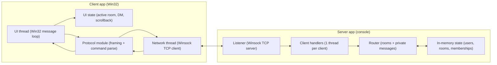

# Architecture

Notes:
- Transport is TCP sockets on a LAN.
- Each TCP connection carries a stream of frames: `[uint32 length][UTF-8 payload]`.
- The payload is a command-text schema like `JOIN room` or `MSG room :text`.

