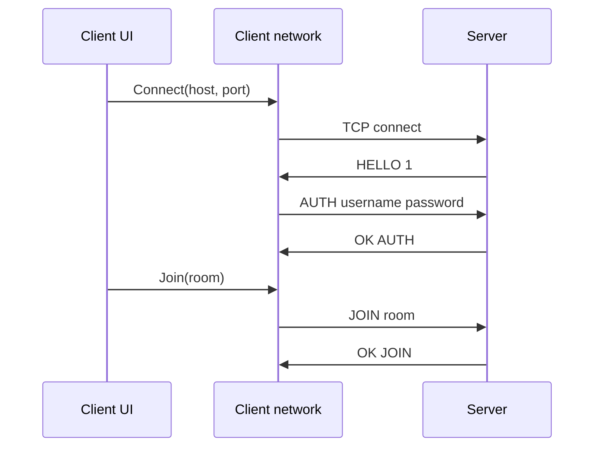
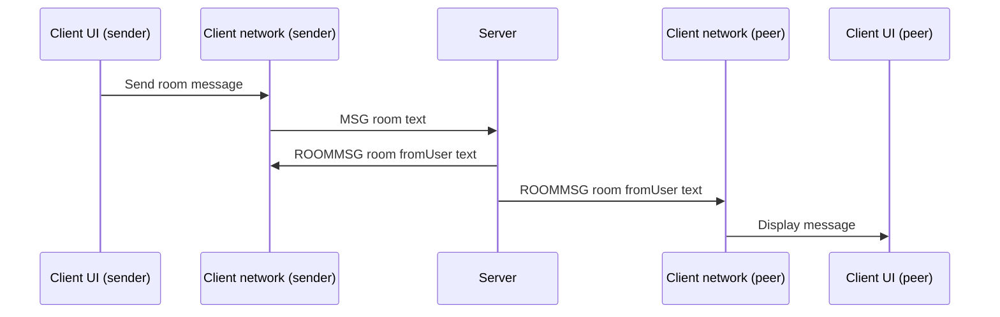
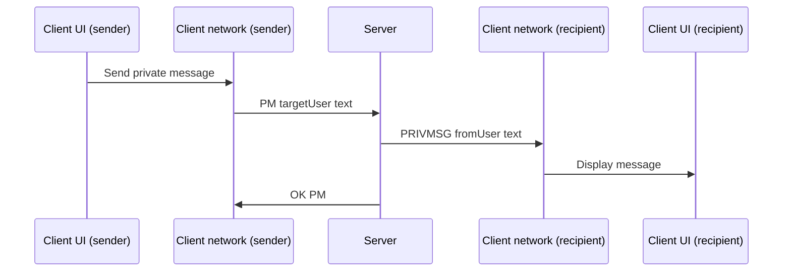

# Sequence

## Connect and join room

```mermaid
sequenceDiagram
    participant UI as Client UI
    participant NET as Client network
    participant S as Server

    UI->>NET: Connect(host, port)
    NET->>S: TCP connect
    S->>NET: HELLO 1
    NET->>S: AUTH username password
    S->>NET: OK AUTH
    UI->>NET: Join(room)
    NET->>S: JOIN room
    S->>NET: OK JOIN
```

## Room message broadcast

```mermaid
sequenceDiagram
    participant UI1 as Client UI (sender)
    participant N1 as Client network (sender)
    participant S as Server
    participant N2 as Client network (peer)
    participant UI2 as Client UI (peer)

    UI1->>N1: Send room message
    N1->>S: MSG room text
    S->>N1: ROOMMSG room fromUser text
    S->>N2: ROOMMSG room fromUser text
    N2->>UI2: Display message
```

## Private message

```mermaid
sequenceDiagram
    participant UI1 as Client UI (sender)
    participant N1 as Client network (sender)
    participant S as Server
    participant N2 as Client network (recipient)
    participant UI2 as Client UI (recipient)

    UI1->>N1: Send private message
    N1->>S: PM targetUser text
    S->>N2: PRIVMSG fromUser text
    N2->>UI2: Display message
    S->>N1: OK PM
```

